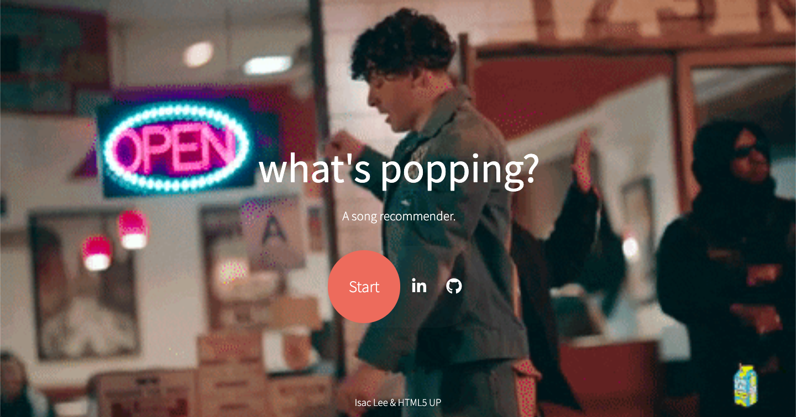

# What's Popping?
You can find the web app [here](http://www.whatspopping.xyz/). 

## Introduction
One of the great things about Spotify is their amazing ability to recommend new songs based on each user's own music personality. 'What's Popping?' attempts to recreate Spotify recommendations through song features such as genre, instrumentalness, danceability, and popularity.
## Credits
* https://github.com/drshrey/spotify-flask-auth-example - Helped me understand how to get Spotify user authorization with Flask. 
