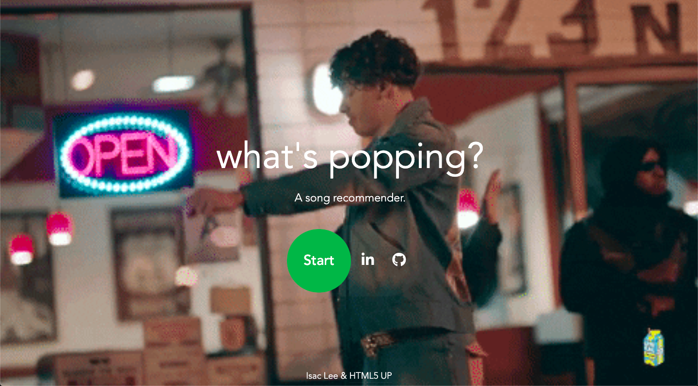

# What's Popping?
You can find the web app . 

## Introduction
One of the great things about Spotify is their amazing ability to recommend new songs based on each user's own music personality.
## Credits
* https://github.com/drshrey/spotify-flask-auth-example - Helped me understand how to use Flask and Spotify's Authorization process
